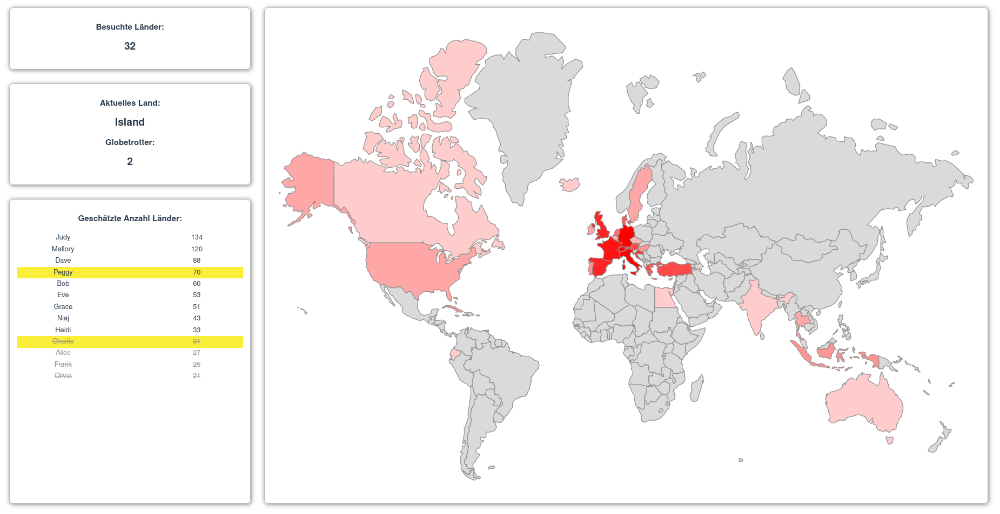

# Globetrotter

A graphic illustration for a guessing game about how many countries a group of players has visited.

## Sneak peak



## Background

This application serves a graphic illustration for a guessing game. The guessing game is about estimating how many countries a group of players has visited on the world. Every player is required to provide a list of countries they were in and a guess on about how many countries this group covers. The list of countries is provided by [country codes](https://en.wikipedia.org/wiki/ISO_3166-1) in its Alpha-2 code format.

Once, all guesses and country lists are set, the guessing game is resolved by decrementally coloring the visited countries on the world map started with the most visited one. In each step, the current country is display with the amount of players visited it and highlighting their names. The next iteration is triggered by clicking on the world map. Players guessed to low are crossed out and when the last country is shown, the three players with the closest guesses are marked as winners.

### Guessing game input format

Every player has to be represented with the following format

```json
{
  "id": 1,
  "name": "Alice",
  "status": 0,
  "guess": 27,
  "visited": [
    "AE",
    "AT",
    "AU",
    "CH",
    "DE",
    "DK",
    "EC",
    "EG",
    "ES",
    "FR",
    "GB",
    "GR",
    "HR",
    "IT",
    "NL",
    "NZ",
    "PT",
    "TN",
    "TR"
  ]
}
```

The fields `name`, `guess` and `visited` are self explanatory. The `id` has to be unique for every player and the `status` has to initially be set to `0` i.e. `OK`.

### Caveat

Not every country is on the map, and therefore not highlighted.

## Project setup

```
yarn install
```

### Compiles and hot-reloads for development

```
yarn serve
```

### Compiles and minifies for production

```
yarn build
```

### Lints and fixes files

```
yarn lint
```

### Customize configuration

See [Configuration Reference](https://cli.vuejs.org/config/).
